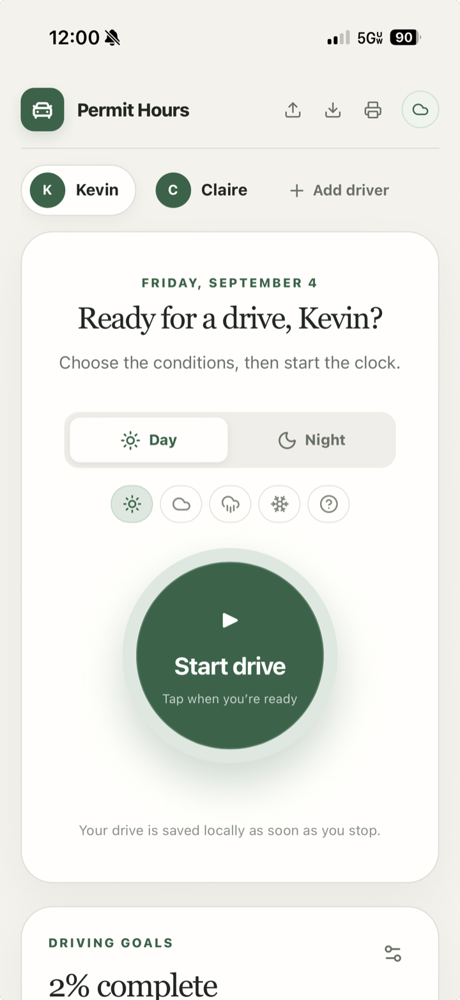

# Permit Hours

Permit Hours is a teen driving-hours tracker to help you track your teen's progress toward a drivers license. It
supports offline access, multiple drivers, one-tap timers, day/night goals, weather conditions, manual entries, family
sync, role-based access, exporting, and importing of popular driving log formats.



## Run locally

```bash
npm install
npm run dev
```

## Deploy to GitHub Pages

The included GitHub Actions workflow builds and publishes the app whenever `main` is pushed. In the repository settings,
set **Pages → Source** to **GitHub Actions**.

The Firebase Authentication authorized-domain list must include `rharder.github.io` for Google sign-in on the published
site.

## Firebase sync and access

The app uses the existing `kids-money-tracker-f24be` Firebase project but stores its data in separate
`permitHourFamilies` and `permitHourAccess` collections. Each household has an isolated document keyed by its owner’s
Firebase user ID. Deploy the checked-in rules before using cloud sync:

```bash
npx firebase-tools deploy --only firestore:rules
```

Any Google account can create its own independent Permit Hours household, become its owner, and upload its current local
log. The owner can add exact Google-account email addresses as either:

- **Supervising adults**, who can start, stop, add, and edit drives.
- **View-only members**, intended for teen drivers who should be able to follow progress without changing the log.

Only the owner can add or remove household access. The rules file also retains the existing Kids Money Tracker rules
because both apps share the same Firebase project.

After adding a member, choose **Email invitation** to open a prefilled draft in your mail app, or **Copy invitation** to
paste it into an email or message. Nothing is sent automatically. Invitations include the app link, access role, the exact
Google account to sign in with, and iPhone Home Screen instructions. Use **Invite** beside an existing member to share
their invitation again. If clipboard access is unavailable, the app shows selectable invitation text for manual copying.
Adding access requires an internet connection; copying invitations for existing members works offline.

## Data and privacy

Driving data is always stored in the browser first. When signed in, Firestore also keeps a persistent local cache and
automatically sends queued changes after connectivity returns. Export JSON regularly as an additional backup, especially
before clearing browser storage.
